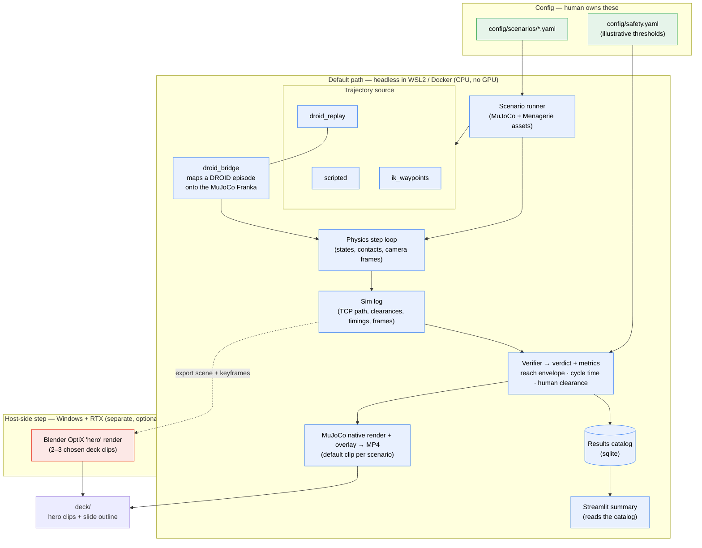

# Architecture diagram

Data flow of the scenario verifier, from human-owned config to the deck clips.
The two shaded lanes make the **execution-environment split** explicit: the
default path runs **headless inside WSL2/Docker** (CPU, no GPU), while the
photoreal hero render runs **natively on the Windows host** to use the RTX card.

> Offline scenario verifier — **not** a live, bidirectionally-synced digital
> twin. See [01-conception.md](01-conception.md) for the honest scope note.

**Legend**

- 🟩 Green — human-owned config (scenarios + illustrative safety thresholds).
- 🟦 Blue — the default, CPU-only path that runs headless in WSL2/Docker.
- 🟥 Red — the optional host-side Blender step that uses the RTX card.

**Excluded by design:** Isaac Sim (below the 8 GB laptop-GPU line — documented
future work only). Orchestration is a simple CLI + Makefile, **not** Airflow —
see [01-conception.md](01-conception.md) for the rationale.
